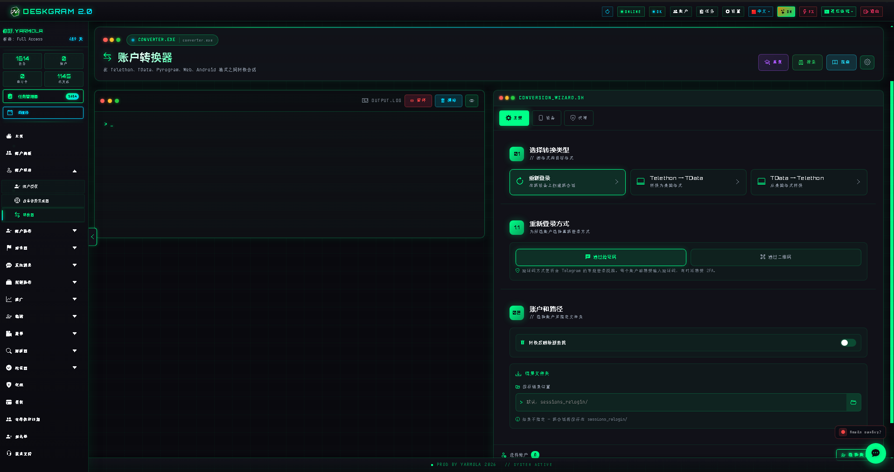
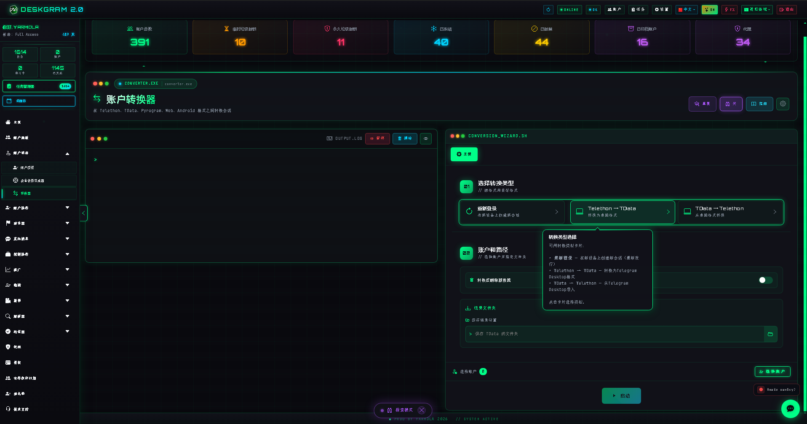
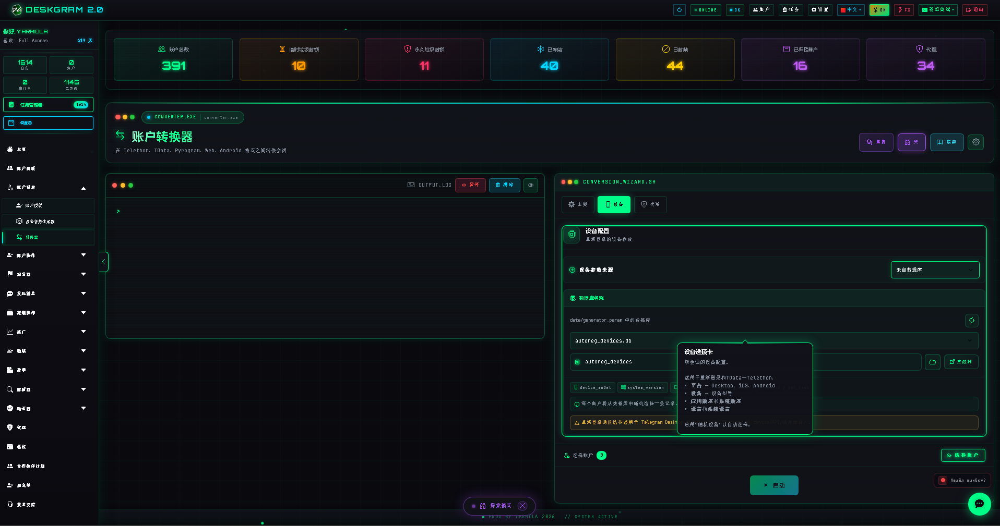
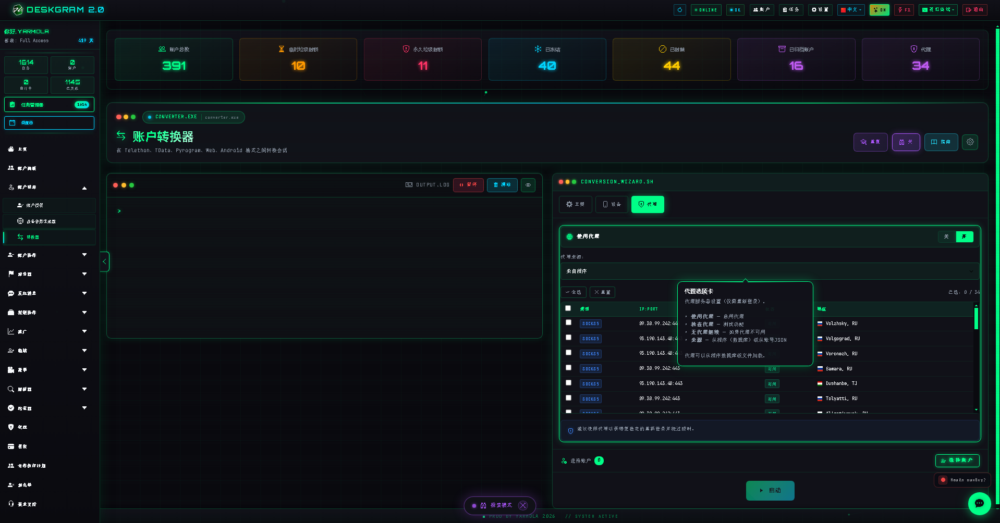

# Deskgram 2 的 Telegram 账号转换器

Deskgram 2 的账号转换器可以在不同工作格式之间转换 Telegram 账号，并在同一路线里管理源路径、结果路径、设备参数和代理参数。

[Deskgram 2 Hub](https://github.com/Deskgram-2/deskgram-2-telegram-automation-zh) · [网站](https://deskgram2.com/) · [Telegram Bot](https://t.me/DG2welcomebot) · [网页预览](https://deskgram2.com/web-preview?path=%2Fapp-demo%2F&lang=cn)

## Interactive Web Preview

浏览器中直接查看模块界面: [打开网页预览](https://deskgram2.com/web-preview?path=%2Fapp-demo%2Ffunctions%2Fconverter&lang=cn)

## Screenshots

## About the module

| Parameter | What is inside |
|---|---|
| Main task | 账号转换与迁移准备 |
| Important blocks | 转换网格、文件路径、设备标签、代理标签 |
| Useful for | 迁移、导入、标准化、账号运维 |
| Related sections | Account Manager, Account Authentication, Proxy Manager, Settings |

## FAQ

### Can I inspect the module before installing anything?

Yes. The web preview already shows the conversion grid plus device and proxy tabs.
